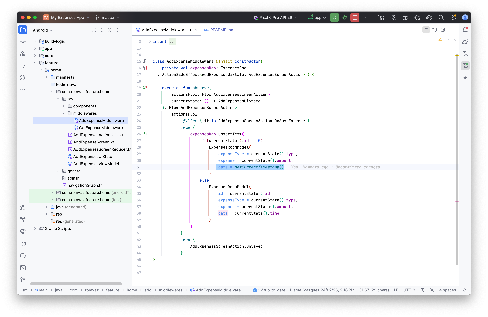

# What is this repository for?

This repository demonstrates the use of Room to store expenses, categorizing them by type and
displaying a chart to show the total percentage of each expense.

# How do I run the project

In order to run the project:

1. Clone the project into your computer
2. Set the gradle JDK to JAVA 17
3. Sync project gradle files. The minimum current supported version is: 2024.1.1 Patch 1 - Koala
4. Run the app module on master

# Dependencies

The project uses [gradle versions catalog](https://docs.gradle.org/current/userguide/platforms.html)
to manage the dependencies and versions.

The definition of dependencies can be find at `gradle/libs.versions.toml`, and new dependencies
should always be added in the file

# Uses cases

This app allows you to add, edit, and delete expenses.

1. To edit, simply click on the expense you want to modify.
2. To delete it, a long press is required.

To add expenses for future months, you can modify the date field using the
`getCurrentTimestampWithAddedMonth()` function instead of `getCurrentTimestamp()` in the
`AddExpenseMiddleware`.

